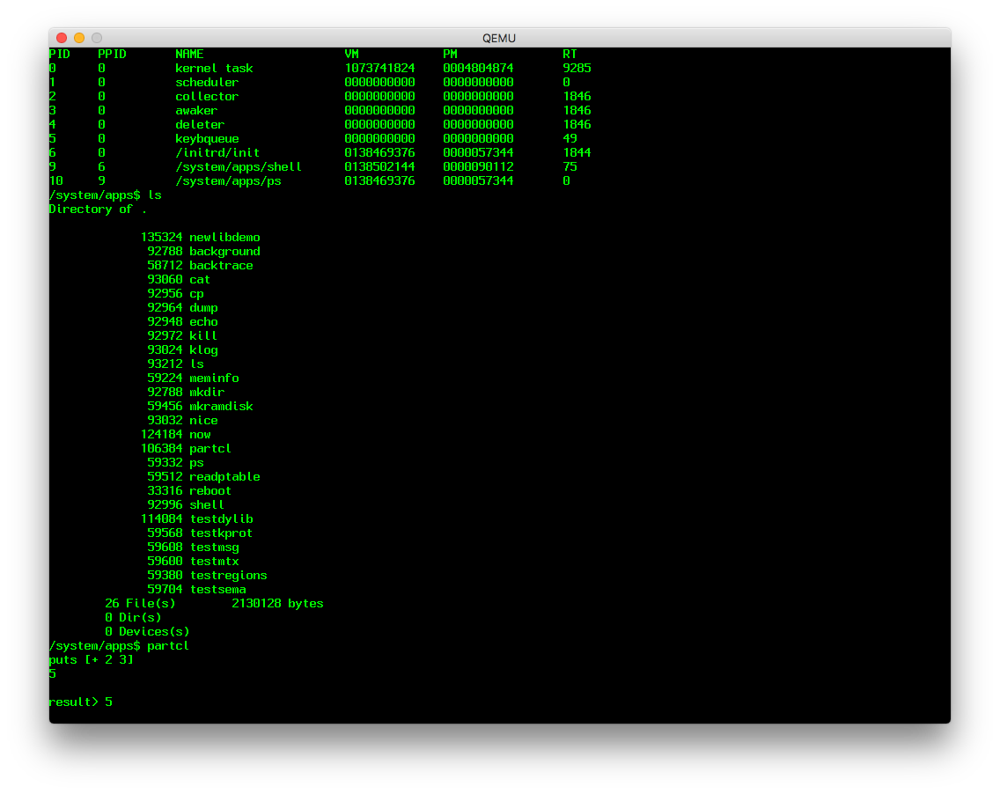
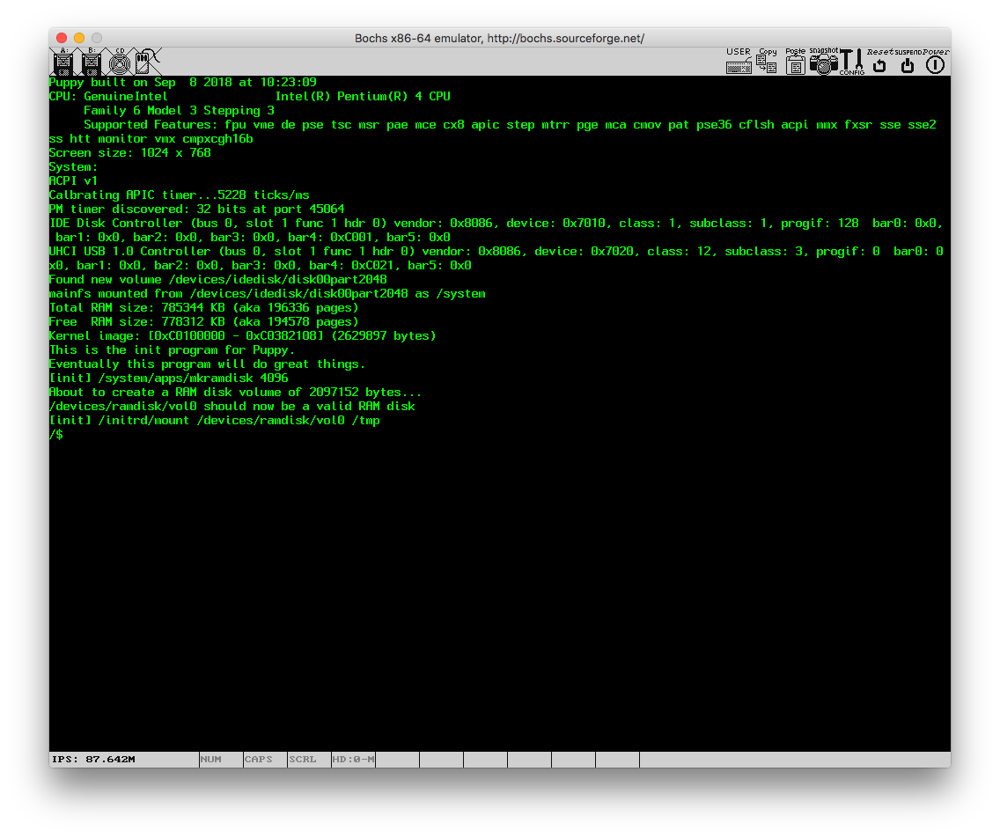

# The Puppy Operating System
[](https://travis-ci.org/egranata/puppy)

Welcome to Puppy.

Puppy is an operating system for IBM-compatible computers with 32-bit Intel CPUs (you may have heard of this kind of hardware under the name *personal computer*).

Development of Puppy has started [on January 1st 2018](docs/initial_commit.png) and the project has been open-source since May 29 2018. Since then, the operating system has grown to provide:

- preemptive multitasking (but not a preemptive kernel);
- memory protection;
- system calls for userspace;
- FAT32 filesystems;
- support for actual physical x86 hardware, including ACPI.

Puppy also includes a partial C/C++ standard library (most notably absent is C++ `iostream`).

Puppy's userspace consists of a mix of custom tools as well as ported open source tools. Notably, there is no full C++ toolchain, but a port of MicroPython is available for scripting.

Future goals and features are covered by https://github.com/egranata/puppy/issues. While I would be very happy to accept input in terms of feature ideas as well as patches (but see below), some things are explicit **non-goals**, namely:

- porting to anything other than x86;
- a GUI (either porting or writing a new one);
- developing a custom bootloader.

# Hardware requirements

Puppy is actively tested on QEMU - and occasionally Bochs.




Assuming a few requirements are met, Puppy should boot and work on an actual PC:
- PS/2 keyboard;
- A video card and screen with VBE support and capable of 800x600 or better;
- Intel CPU from - at least - the early-2000s (*);
- at least 1GB of RAM (**).

(*) Testing with Bochs suggests that Puppy can boot on something as old as a Pentium Pro, but this is untested on real hardware.
Alas, booting on anything older is currently not possible (see https://github.com/egranata/puppy/issues/63).

(**) Testing with QEMU suggests that 32MB is the minimum required for Puppy to boot to userspace, but this is untested on real hardware.2

If your system has a physical serial port, you should be able to collect kernel logs which might help in diagnosing boot-time issue. I personally use `picocom` for this purpose, but other tools should work if they're capable of 8N1 115200 operation. Patches to enable customizing the serial port settings at boot would be gladly accepted.

Testing on other virtualizers and/or real hardware is also most welcome.

# Software requirements

To compile a Puppy image, you'll want to use Linux (native or in a VM/container; Docker is known to work). Dependencies for compilation are aptly described by `build/deps.sh` (the script used to setup a CI instance).

# Getting started

Assuming you have the proper bits and pieces in place, to compile the project, just type

```
$ ./build.py
```

in a shell. This will churn for a while (should be under a minute) and produce a bootable HD image `out/os.img`.

The HD image includes the kernel, as well as a fairly minimal userspace + suite of tests. It can be used to boot an emulator, or bit-blasted to a real hard disk.

A sample configuration for Bochs and QEMU launcher script can be found in the `build` directory.

Assuming everything works, booting Puppy ends up with a shell prompt. `ls` works to start exploring the file-system.

# Contributing

Contributions to the project are very welcome.

The issues list (https://github.com/egranata/puppy/issues) is actively maintained with new units of work, and issues that would benefit from help and/or are great starting points are marked as such.

If you would like to try porting userspace software to Puppy, or add drivers for new hardware, that is also welcome - any and all issues you encounter doing this are definitely worth reporting.

In order to expedite your contribution all the way to acceptance, please see `CONTRIBUTING.md` and follow the instructions therein.

Please be aware that **this is not an officially supported Google product**.
